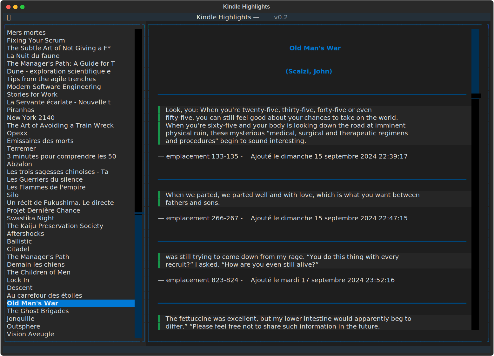

# Kindle Highlights

A Python application to view and browse your Kindle highlights and notes using a modern terminal user interface.



## Features

- Browse all books from your Kindle clippings file
- View all highlights for a selected book
- Display highlight location and date information
- Simple and intuitive terminal interface

## Installation

1. Clone this repository:
   ```bash
   git clone https://github.com/frica/kindle-highlights.git
   cd kindle-highlights
   
2. Run uv:
   ```bash
   uv run main.py --file path/to/your/My Clippings.txt

## Usage
Run the application by providing the path to your Kindle "My Clippings.txt" file:

### Keyboard Controls
* Arrow keys: Navigate through the book list
* Enter: Select a book to view its highlights
* r: Refresh the book list
* q: Quit the application

### Command Line Options

For basic information about your clippings, you can use the command-line interface:
    
```bash
python clipping_processor.py "My Clippings.txt" --list
```

## Requirements
* Python 3.12+
* Textual

## License
MIT